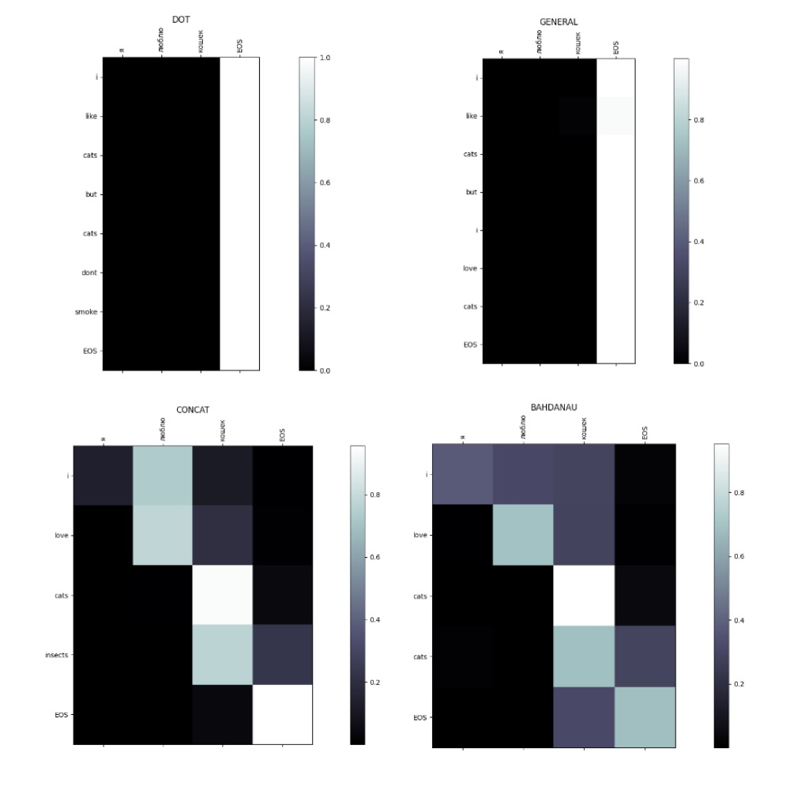
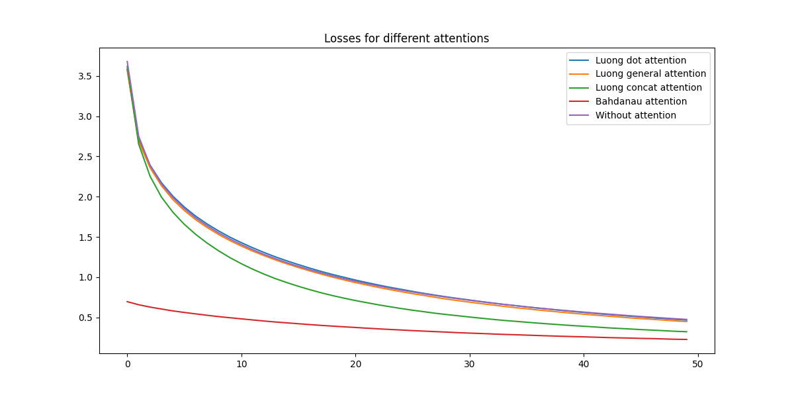

# RNN Attention

Репозиторий содержит эксперимент по обучению Seq2Seq модели с разными видами механизма attention и сопровождает пост [Attention: Attention!](https://teletype.in/@jdata_blog/B0T5Mn4DjF9). Присоединяйтесь к чтению и запускайте код =)

Для эксперимента реализованы Bahdanau attention и Luong Attention, Luong Attention обобщаются способы: 

- dot attention: $s_i^Th_j$ — скалярно перемножаем скрытые слои энкодера и декодера
- general attention: $s_i^TW_1h_j$ —  перемножаем скрытые слои энкодера и декодера с промежуточной матрицей весов между ними
- concat attention: $v^Ttanh(W_1[s_i;h_j])$ — умножаем обучаемый вектор весов на тангенс от взвешенного векторного произведения скрытых слоёв энкодера и декодера (почти Bahdanau)

Bahdanau attention: $e_{ij} = tanh(h_jW_1 + s_iW_2)v$, где $W_1, W_2$ - обучаемые матрицы весов, а $v$ - обучаемый вектор весов.

Реализованные подходы к вниманию вы можете найти в файле `attentions.py`, а сами модели в файле `models.py`.

## Результаты

Лучшим подходом к вниманию действительно оказался Bahdanau attention. Время обучения увеличилось примерно на 20% и функция потерь оказалась ниже более чем в два раза. 

## Attention x Explainab;e AI
Позволяет ли внимание сделать "прозрачную" модель? И да, и нет. 
 В настоящее время показано, что:

- возможно полностью изменить веса внимания и добиться того же прогноза (также веса внимания допускают и другие состязательные вмешательства);
- веса внимания не обязательно коррелируют (часто — вообще не коррелируют) с другими методами объяснения;

Кроме того, опровергая attention в качестве объяснения, исследователи отмечают, что внимание строится не на основе самих слов, а на основе их эмбеддингов, что тоже умаляет точность построенных карт. Данный факт можно оспорить, сформулировав гипотезу о том, что модель имитирует пространство слов корпуса в векторном пространстве. Но насколько эта гипотеза является правдой, в силу больших размерностей, открытый вопрос. 

Общий вывод о внимании
Attention — сильный инструмент, улучшающий качество модели. На свойство объяснимости attention также влияет, однако является не более и не менее чем ещё одной попыткой глубже понять скрытые зависимости, изучаемые моделью.

Спасибо за ваше внимание, друзья!
Всегда рада видеть вашу обратную связь в [Data Blog'е](https://t.me/jdata_blog), где я пишу про объяснимость моделей и свой опыт в области Data Science и буду рада видеть вас на [курсе](https://stepik.org/a/198640) про explainable AI! 

*До новых встреч и доброго вам времени,*

*Ваш Дата-автор!*