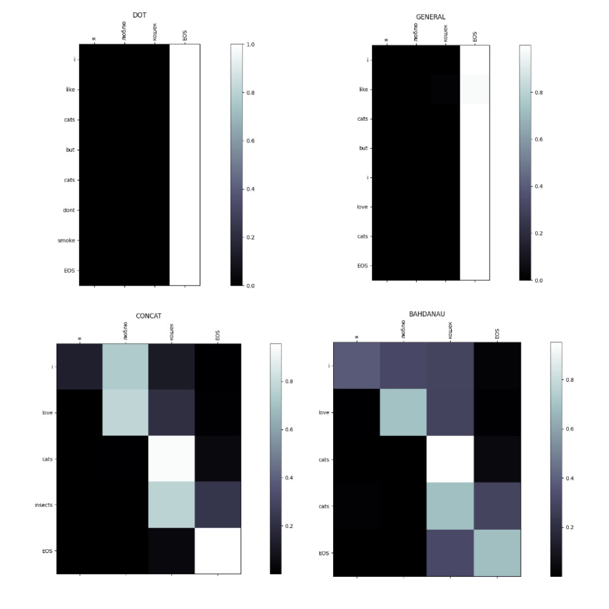
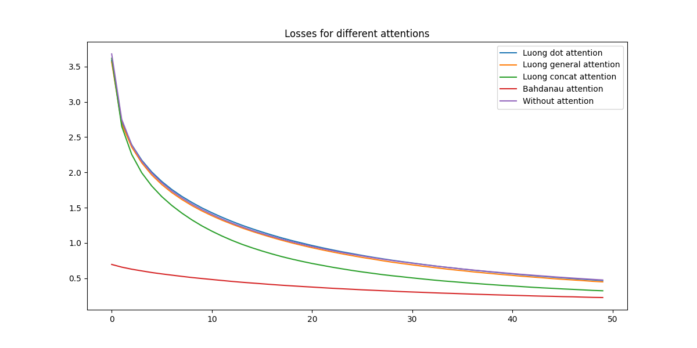

# **RNN Attention**

Experiment with Seq2Seq models and various attention mechanisms (Bahdanau, Luong: dot, general, concat). The repository accompanies the post [Attention: Attention! (rus)](https://teletype.in/@jdata_blog/B0T5Mn4DjF9) and includes implementations of attention modules (`attentions.py`) and models (`models.py`).

## Attention Types

* **Luong dot attention**:

  $$
  score(s_i, h_j) = s_i^T h_j
  $$

* **Luong general attention**:

  $$
  score(s_i, h_j) = s_i^T W_1 h_j
  $$

* **Luong concat attention**:

  $$
  score(s_i, h_j) = v^T \tanh(W_1 [s_i; h_j])
  $$

* **Bahdanau attention**:

  $$
  e_{ij} = v^T \tanh(h_j W_1 + s_i W_2)
  $$

____________________________
#  **RNN Attention**

Эксперимент с Seq2Seq моделями и различными механизмами внимания (Bahdanau, Luong: dot, general, concat). Репозиторий сопровождает пост [Attention: Attention!](https://teletype.in/@jdata_blog/B0T5Mn4DjF9) и содержит реализации attention-модулей (`attentions.py`) и моделей (`models.py`).

## Виды Attention

* **Luong dot attention**:

  $$
  score(s_i, h_j) = s_i^T h_j
  $$

* **Luong general attention**:

  $$
  score(s_i, h_j) = s_i^T W_1 h_j
  $$

* **Luong concat attention**:

  $$
  score(s_i, h_j) = v^T \tanh(W_1 [s_i; h_j])
  $$

* **Bahdanau attention**:

  $$
  e_{ij} = v^T \tanh(h_j W_1 + s_i W_2)
  $$

